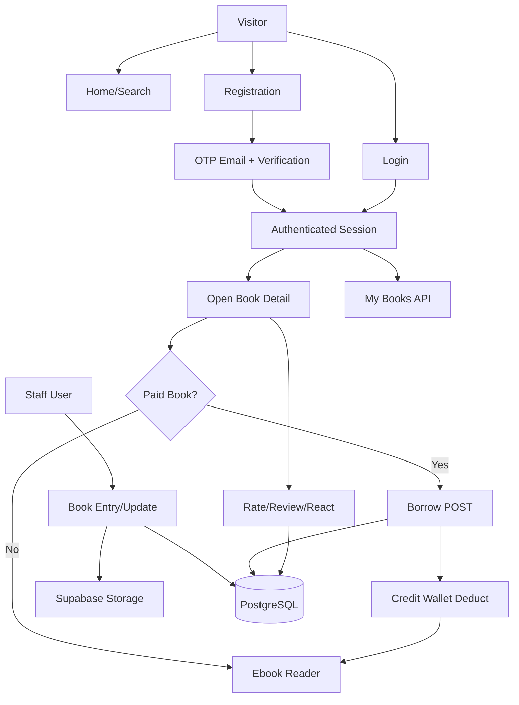
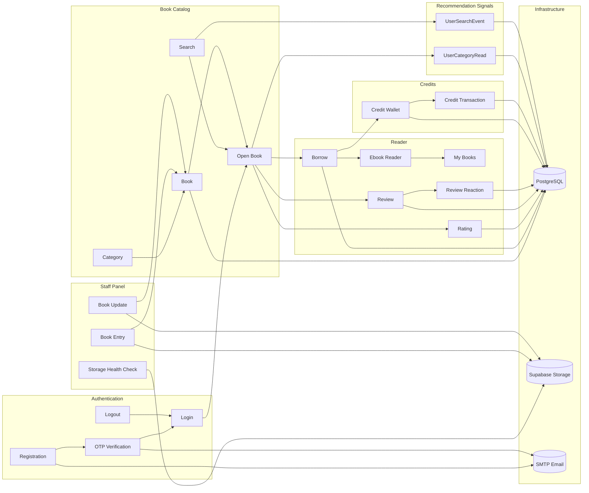
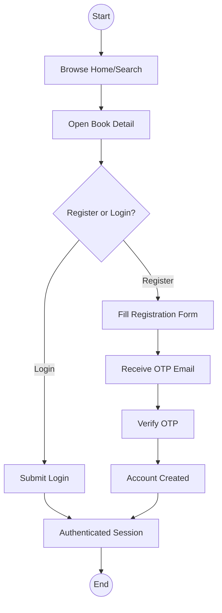
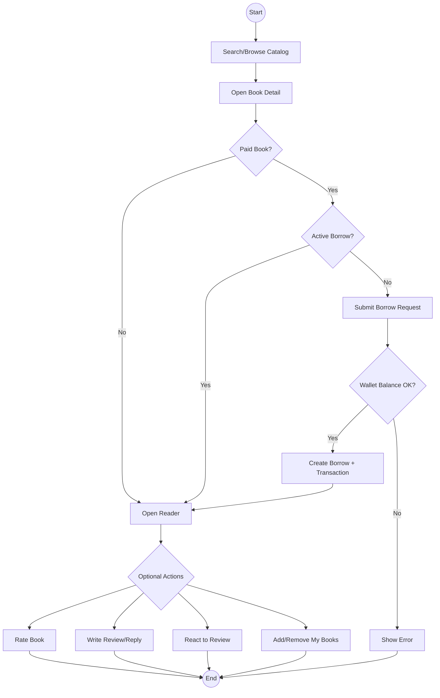
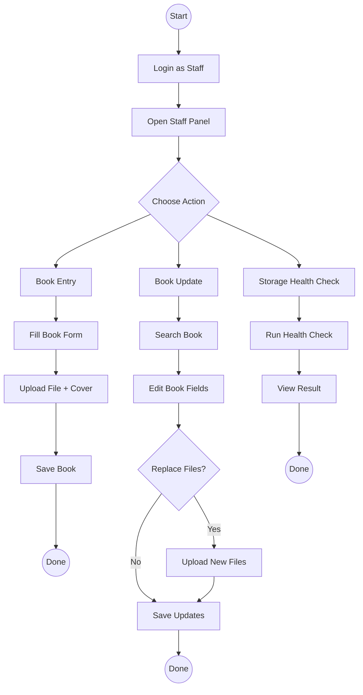
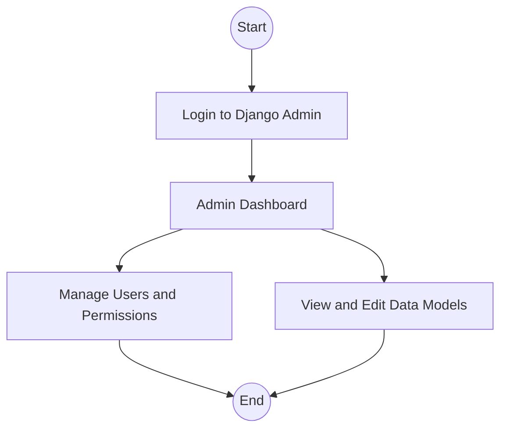
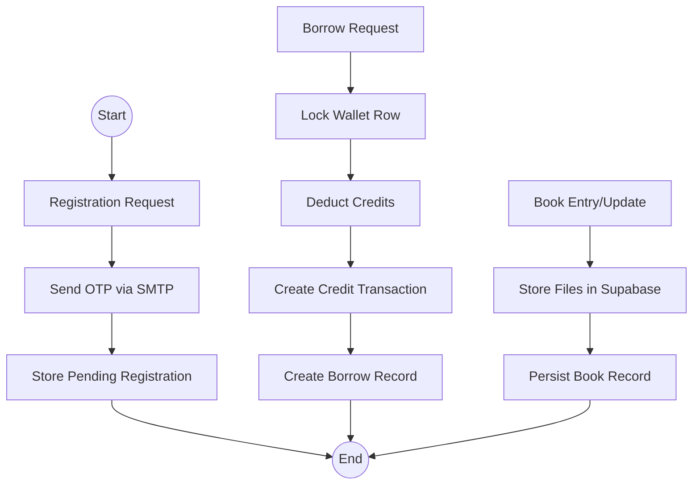

# Online-Book-Library
The project name is DigiSelf. DigiShelf is a web-based online book library platform built with Django, designed to provide users with a seamless digital reading experience. It allows users to explore, review, and access a wide collection of books with an intuitive and modern interface.

## 1. Overview

DigiShelf is a Django-based digital library and ebook lending platform. It provides:

- Email and OTP based registration with session verification
- Login/logout with email as the primary identifier
- Book discovery, search, and recommendation flows
- Book borrowing with credit based pricing and time limited access
- Ratings, reviews, and threaded replies with reactions
- Personal library (My Books) with JSON endpoints
- Staff only book management and storage health checks
- Support contact form that sends email to staff

The platform is a single Django project with multiple apps that separate authentication, catalog logic, staff operations, and personalization.

## 2. Project Goals and Scope

- Provide a clean reader experience for paid and free ebooks
- Allow staff to add and update book catalog items with pricing tiers
- Support transactional credit deductions for paid borrows
- Enable community feedback through ratings and reviews

## 3. Application Layers

- Django templates for server-rendered UI pages
- Django views for request handling and orchestration
- Django models for persistence and relationships
- Supabase Storage (S3-compatible) for book files and cover images
- PostgreSQL for primary data storage
- SMTP for OTP emails

## 4. Request Flow Diagram

### 5. External Services

- **PostgreSQL** for the primary database
- **Supabase Storage** for book files and cover images
- **SMTP** for OTP email delivery

## 6. Project Structure

Top-level layout (key folders only):

- [core/manage.py](core/manage.py) - Django entry point
- [core/core/](core/core/) - Django project settings and URL routing
- [core/app/](core/app/) - Primary data models and informational pages
- [core/site_controller/](core/site_controller/) - User-facing browsing, search, open book, borrow, and reader flows
- [core/authentication/](core/authentication/) - Registration, OTP, and login
- [core/data_entry/](core/data_entry/) - Staff book entry and storage checks
- [core/recommendation_system/](core/recommendation_system/) - Recommendation signals and scoring
- [core/payments/](core/payments/) - Placeholder payments app
- [core/templates/](core/templates/) - HTML templates
- [core/statics/](core/statics/) - CSS and JS assets

### 7. Storage

Supabase Storage uses S3-compatible settings and custom storage backends.
- Buckets:
    - `book-files` for ebook files
    - `cover-image` for book covers

- Required settings in [core/core/settings.py](core/core/settings.py):
    - `SUPABASE_PROJECT_REF`
    - `SUPABASE_S3_ENDPOINT`
    - `AWS_ACCESS_KEY_ID`
    - `AWS_SECRET_ACCESS_KEY`
    - `AWS_S3_ENDPOINT_URL`
    - `AWS_S3_REGION_NAME`

## 8. Data Model

All primary models are defined in [core/app/models.py](core/app/models.py).
Recommendation signal models live in [core/recommendation_system/models.py](core/recommendation_system/models.py).

### 8.1 CreditWallet

- One-to-one with `User`
- Tracks credit balance and last update

### 8.2 CreditTransaction

- Logs credit changes (`ADD` or `DEDUCT`)
- References borrow actions by `reference_id`

### 8.3 Category

- Name plus unique `ml_code`
- Used for book classification and search

### 8.4 Book

- Primary catalog entity
- Attributes include title, author, description, category, genres
- Pricing tiers for 7, 14, 20, 30 day borrowing
- `book_paid` indicates free vs paid
- File and cover stored via Supabase Storage

### 8.5 MyBook

- User personal library entries
- Unique constraint per user/book

### 8.6 Borrow

- Tracks active borrows, expiry date, credits used
- Only active borrows allow access to reader for paid books

### 8.7 ReadingProgress

- Tracks last page per user/book
- Not currently used by views, reserved for future reader progress

### 8.8 Rating

- Star rating 1 to 5
- Unique per user/book

### 8.9 Review

- Text review with optional parent review for threaded replies

### 8.10 ReviewReaction

- Like reaction for reviews
- Unique per user/review

## 9. Authentication and Authorization

### 9.1 Registration and OTP

- User submits email, full name, and password
- OTP is generated and emailed
- OTP is stored in session with 10 minute expiry
- Successful verification creates a `User` using email as username

### 9.2 Login and Logout

- Login uses email as the lookup field
- Validates user password and active status
- Logout clears session

### 9.3 Roles

- `superuser` and `staff` can access the staff panel
- `customer` and `anonymous` users cannot access staff routes

## 10. User Features

### 10.1 Home

- Shows latest books and a randomized list for discovery
- Template: [core/templates/home.html](core/templates/home.html)

### 10.2 Search

- Full-text search over title, author, description, genres and     category
- Prioritized ranking on exact and prefix matches
- Paginated results and empty state notices
- Suggestions endpoint for live search

### 10.3 Book Detail (Open Book)

- Displays book details, genres, recommendations
- Handles rating and review submissions via POST
- Shows comments and replies with pagination
- Calculates borrow options based on pricing slabs

### 10.4 Ratings and Reviews

- Rating range is 1-5
- Each user can have one rating per book
- Reviews support threaded replies
- Review reactions support `LIKE`

### 10.5 Borrowing

- Borrowing applies only to paid books
- Select duration (7, 14, 20, 30 days) and cost
- Uses `CreditWallet` and creates `CreditTransaction`
- Access ends after expiry date

### 10.6 Ebook Reader

- Requires login
- Requires active borrow for paid books
- Renders `ebook-reader.html` with book file URL

### 10.7 My Books (Personal Library)

- JSON endpoints to list, add, and remove books
- Paid books can only be added if borrowed

## 11. Staff Features

### 11.1 Book Entry

- Staff-only form for creating new books
- Accepts title, author, description, genres, category
- Handles paid/free status and pricing tiers
- Uploads book file and cover image to Supabase Storage

### 11.2 Book Update

- Staff-only update flow
- Search by book ID or (title + author)
- Supports partial updates and replaces files if provided

### 11.3 Storage Health Check

- Staff-only JSON health endpoint
- Optional write test to validate credentials and bucket access

## 12. Templates and Pages

- `base.html`         - shared layout
- `home.html`         - home and featured books
- `search_page.html`  - search results and filters
- `openbook.html`     - book detail, reviews, borrowing
- `ebook-reader.html` - PDF reader
- `registration.html` - registration form
- `otp_verify.html`   - OTP verification
- `login.html`        - login form
- `book_entry.html`   - staff book entry
- `book_update.html`  - staff book update
- `about.html`        - informational pages
- `support.html`      - informational pages
- `review_item.html`  - review tree rendering

## 13. Knowledge Graph Diagram

Legend:

- Boxes represent major modules, features, or entities.
- Cylinders represent external systems or storage services.
- Arrows represent primary data or request flow direction.

## 14. UML Activity Diagrams (All Actors)

### 14.1 Visitor or Guest

### 14.2 Authenticated User

### 14.3 Staff User

### 14.4 Superuser or Admin

### 14.5 System Services

## 15. Features
- Role based navigation: staff users see Book Entry; guests see Login/Register; authenticated users get the profile menu.
- Mobile navigation drawer for small screens.
- Home page category filter dropdown filters visible book cards on the client.
- Home page Last Update section uses a horizontal scroll row.
- Home page Books section is randomized on each refresh.
- Paid vs free label badges on every book card.
- Search page with ranked results, pagination, and live suggestions (keyboard navigation supported).
- Search and open book pages show recommendation carousels in horizontal scroll rows.
- Open book page shows rating average and count.
- Star rating UI (1 to 5) with update or remove by reselecting the same star.
- Comments with modal view, pagination, threaded replies, edit/delete for own comments.
- Like reactions on comments with live counts (login required to react).
- Free books: Read Now and Add to My Library are available without login for reading.
- Paid books: Borrow button shows borrow duration options; Read Now is available only with an active borrow.
- Borrowing debits CreditWallet and creates CreditTransaction; active borrows have expiry dates.
- My Book: add from open book, list via profile menu modal, remove with confirm, and open reader/detail links.
- Ebook reader: table of contents, page thumbnails, bookmarks, in-book search, zoom, and fullscreen.
- Ebook reader: theme switcher (dark, light, sepia), keyboard shortcuts, progress bar, and time remaining estimate.
- Ebook reader: watermark and protection guards (disable right click, save, print, and drag).
- Registration with OTP verification, resend support, and client countdown timer.
- Live email validation on registration and login; password match checks on registration.
- Support form with client validation and server email delivery to staff.
- Staff book entry with paid or free toggle and credit pricing slabs.
- Staff book update by ID or title + author, with optional file replacement.
- Storage health check JSON endpoint with optional write test.

